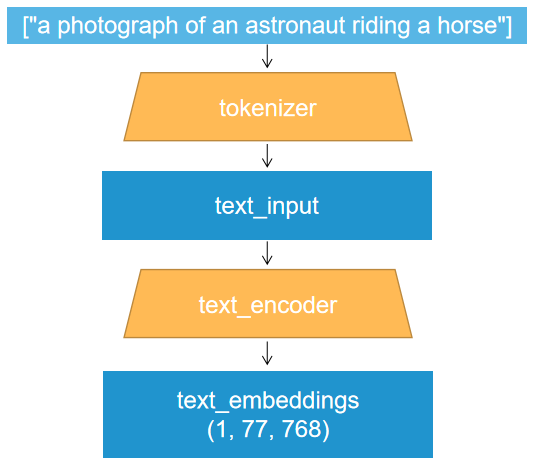
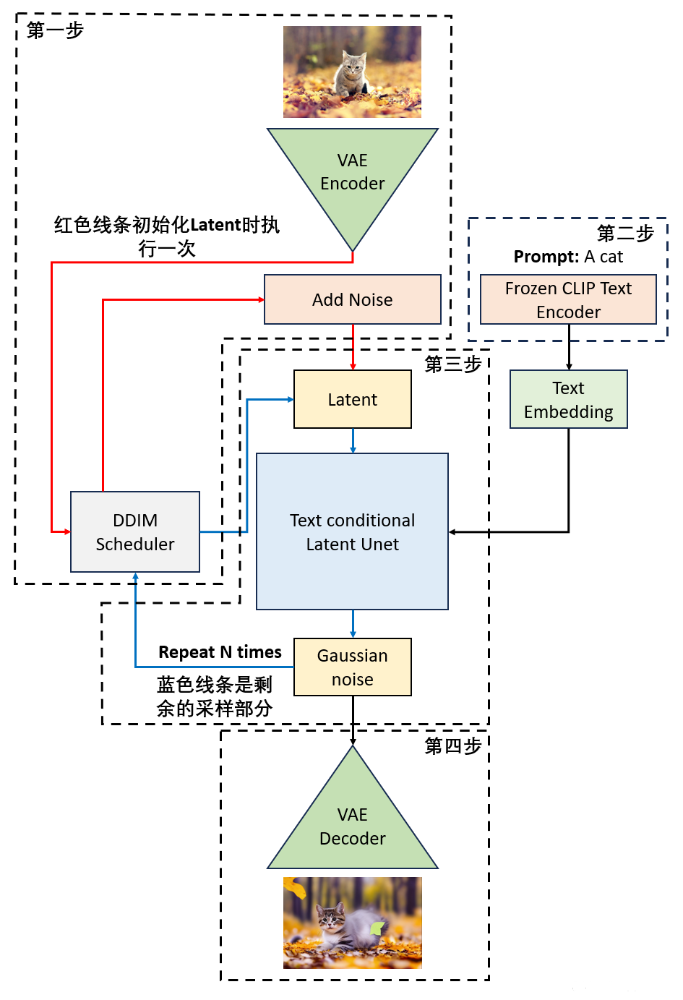
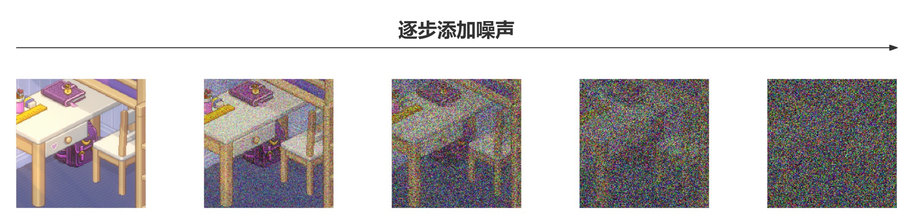
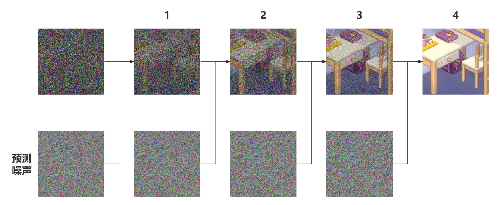
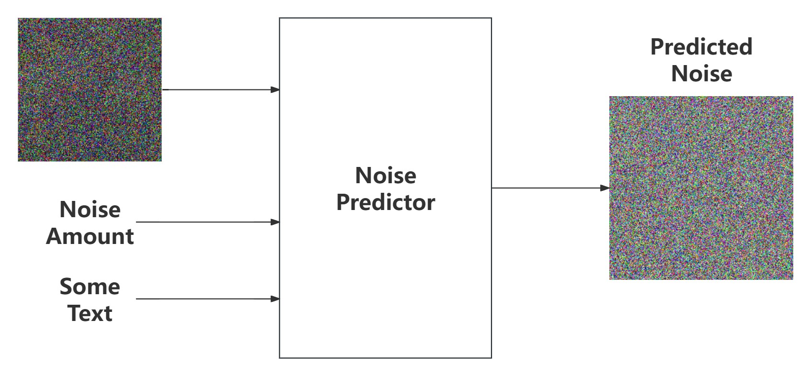

# 人工智能导论自主学习
## StableDiffusion

    https://github.com/Stability-AI/stablediffusion

Stable Diffusion(SD)模型是由Stability AI和LAION等公司共同开发的**生成式模型**，可以用于文生图、图生图、图像inpainting，ControlNet控制生成，图像超分等丰富的任务。

## Stable Diffusion原理
Stable Diffusion和GAN等生成式模型一样的是，SD模型同样学习拟合训练集分布，并能够生成与训练集分布相似的输出结果，但与它们不同的是SD模型的训练过程更加稳定，而且具备更强的泛化性能。

### 扩散模型
Stable Diffusion是一个扩散模型。扩散模型是通过神经网络学习从纯噪声数据逐渐对数据进行去噪的过程，从单个图像样来看，扩散过程就是不断往图像上添加噪声直到图像变成一个纯噪声。逆扩散过程就是从纯噪声生成一张图像的过程。它包含两个步骤：
1. 固定的前向过程：在这一步逐渐将高斯噪声添加到图像中，直到得到一个纯噪声的图像；
2. 可学习的反向去噪过程：在这一步从纯噪声图像中逐渐对其进行去噪，知道得到真实的图像

Diffusion模型用于生成与训练数据相似的数据。从根本上来说，Diffusion模型的工作原理，是通过连续添加高斯噪声来破坏训练数据，再反转这个过程，用于学习恢复数据。而训练目的便是让扩散模型每次预测出的噪声和每次实际加入的噪声做回归，让扩散模型能预测出每次实际加入的真实噪声。

## Stable Diffusion模型的网络架构
Stable Diffusion主要由VAE（变分自编码器， Variational Auto-Encoder），U-Net以及CLIP Text Encoder三个核心组件构成。

### VAE模型
VAE的Encoder结构能讲输入图像转化为低纬Latent特征，并作为U-Net的输入。VAE的Decoder结构能将低纬Latent特征重建还原成像素级图像。

VAE能够压缩数据，因此可以极大程度缩小计算复杂性，计算效率大大提升，同时也降低了硬件需求。正因如此，Stable Diffusion可以在较低配置的平台上运行。

VAE对图像的压缩可以看作是一个有损压缩，但由于自然图像并非完全随机，而是具有很高的规律性，因此这样的压缩并不会对图像的特征带来很大的损失。这也是模型能够使用VAE进行空间压缩的原因。在损失不大的前提下降低计算量，这便是VAE的作用

StableDiffusion中的VAE编码器实现位于/ldm/models/autoencoder.py，其编码器与解码器定义在ldm/modules/diffusionmodules/model.py中的Encoder类与Decoder类

### U-Net模型
在Stable Diffusion是一个基于潜在扩散模型（LDM， Latent Diffusion Model）的一个模型，U-Net模型是关键核心，其在模型中的主要作用是预测噪声残差，并结合调度算法对特征矩阵进行重构，从而将随机噪声转化成图片。

UNet的算法框架主要由编码器和解码器两个部分组成。编码器使用卷积层和池化层来逐渐见效特征图的尺寸和维度，同时增加特征图的通道数，以便提取输入图像的特征；解码器则使用反卷积层（或上采样）和卷积层来逐渐还原特征图的大小和维度麻醉中输出与原始图像大小相同的特征图。

在编码器和解码器之间，UNet还加入了跳连机制，将编码器中相应层的特征与解码器相应层的特征进行连接，以帮助保留更多的空间信息和细节特征。这种机制使得UNet可以使用来自不同层次的特征信息，从而提高图像分割的准确性和鲁棒性。

UNet整体网络结构呈现U型，因此得名UNet，结构如图所示：

stablediffusion模型中的UNet模型位于/ldm/modules/diffusionmodules/openaimodel.py

### Clip Text Encoder模型
作为文生图模型，Stable Diffusion中的文本编码模块直接决定了语义信息的优良成都，从而影响到最后图片生成的多样性和可控性。Stable Diffusion中的文本编码模块使用了OpenAI的CLIP模型，CLIP模型是一个基于Transformer的文本编码模型，其能够将文本编码成一个向量，从而能够将文本信息与图像信息进行对齐，从而实现文生图的功能。

CLIP模型是基于对比学习的多模态模型主要包含Text Encoder和Image Encoder两个模型。其中TextEncoder用来提取文本的特征，可以使用NLP中常用的text transformer模型作为Text Encoder；而Image Encoder用来提取图像特征，可以使用CNN/vision transformer模型作为Image Encoder。CLIP模型的训练目标是让Text Encoder和Image Encoder能够将同一张图片和描述图片的文本编码成相同的向量。

对于包含N个文本-图像对的训练patch，将N个文本特征和N个图像特征两两组合，得到N^2个组合，其中N个组合对应的文本和图像是同一个，其余N^2-N个组合对应的文本和图像是不同的。对于每个组合，CLIP模型都会计算文本特征和图像特征的余弦相似度，然后将同一个文本-图像对应的余弦相似度设为1，其余余弦相似度设为0，然后将所有组合的余弦相似度求和，得到一个损失函数，最小化这个损失函数，就能够让同一个文本-图像对应的余弦相似度尽可能接近1，而不同文本-图像对应的余弦相似度尽可能接近0，从而实现对比学习。

在完成模型的预训练后，可以使用模型进行zero-shot预测。首先创建一个标签集，并得到每一个标签的特征向量；然后，取一张图片，通过Image Encoder获得该图片的特征向量；最后计算图片向量和文字向量的相似度，取相似度最高的那一条label即可

## Stable Diffusion模型的工作流程

以图生图任务为例，图生图任务是指将一段文本和一张图片输入Stable Diffusion中，经过一定的迭代次数，SD模型输出一张符合文本与图片描述的图片。在图生图任务中，模型首先接受一张图像，利用VAE编码器对这张图像进行编码，使其进入隐空间，然后使用该Latent特征基于DDIM Sampler进行加噪，此时获得输入图像加噪后的特征，后续将在这个图像的基础上进行采样；然后，模型接受一段文本，使用CLIP模型对文本进行编码，得到文本的特征向量；模型将加噪后的图像与文本特征向量输入Unet网络进行多次迭代；最后，模型将迭代完成的隐空间解码生成图片。这边是图生图任务的工作流程

而对于文生图任务，其工作流程和图生图任务类似，试讲一段文本输入Stable Diffusion，经过一定的迭代次数，，输出一张符合文本描述的图片，在这个过程中由于没有接受参考图像，因此在VAE编码器中输入的是一张随机的高斯噪声，此后的流程和图生图任务相同

## Stable Diffusion模型的训练过程
StableDiffusion的训练过程可以看作是一个加噪声与去噪声的过程，在这个针对噪声的对抗过程中学习生成图片的能力

模型的整体训练逻辑为：
1. 从数据集中随机选择训练样本
2. 从K歌噪声量级中随机抽样一个timestep
3. 产生随机噪声
4. 计算当前产生的噪声数据
5. 将噪声输入**U-Net**预测噪声
6. 计算产生的噪声和预测的噪声的L2损失
7. 计算梯度并进行参数更新

### 在训练集中加入噪声
在训练模型时，需要输入加噪的数据集，使用random函数生成由强到弱各个强度的噪声，通过Time Embedding嵌入到SD的训练过程中。

### 加噪与去噪
在训练过程中，首先对干净的样本进行加噪处理，采用多次逐步增加噪声的方式，直到干净样本转变为纯噪声。

然后，让模型学习去噪过程，然后抽象出一个高维函数，这个函数能在纯噪声中‘优化’噪声，得到一个干净样本。其中，将去噪过程具象化，就是使用UNet预测噪声，并结合Schedule算法逐步去噪的过程。

在完成噪声的预测后，计算预测噪声与真实噪声的误差，最后通过反向传播更新UNet的参数，完成UNet训练。

### 语义信息对图片生成的控制

在模型训练中，每个训练样本都会对应一个标签，将对应标签通过CLIP Text Encoder输出Text Embedding，并将Text Embedding以Cross Attention的形式与UNet结构耦合，使得每次输入的图片信息与文字信息进行融合训练

## 参考文章

深入浅出完整解析Stable Diffusion（SD）核心基础知识 - Rocky Ding的文章 - 知乎

    https://zhuanlan.zhihu.com/p/632809634

Diffusion扩散模型学习3——Stable Diffusion结构解析-以图像生成图像（图生图，img2img）为例

    https://codeantenna.com/a/m1lDgPkkSq

理解变分自编码器（VAE） - 周巴卡的文章 - 知乎

    https://zhuanlan.zhihu.com/p/519448634

Hugging Face Diffusion Models Course-CN

    https://github.com/darcula1993/diffusion-models-class-CN.git

手写stable-diffusion - 罗培羽的文章 - 知乎

    https://zhuanlan.zhihu.com/p/621325215

扩散模型之DDPM - 小小将的文章 - 知乎

    https://zhuanlan.zhihu.com/p/563661713