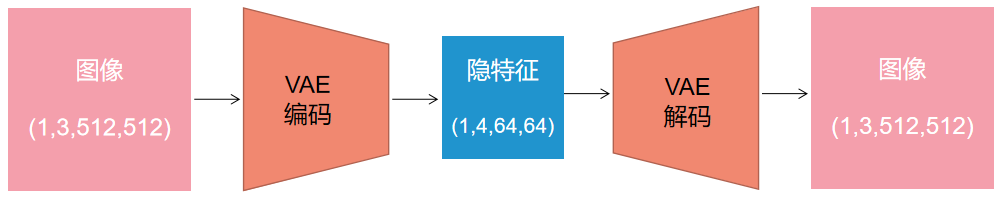
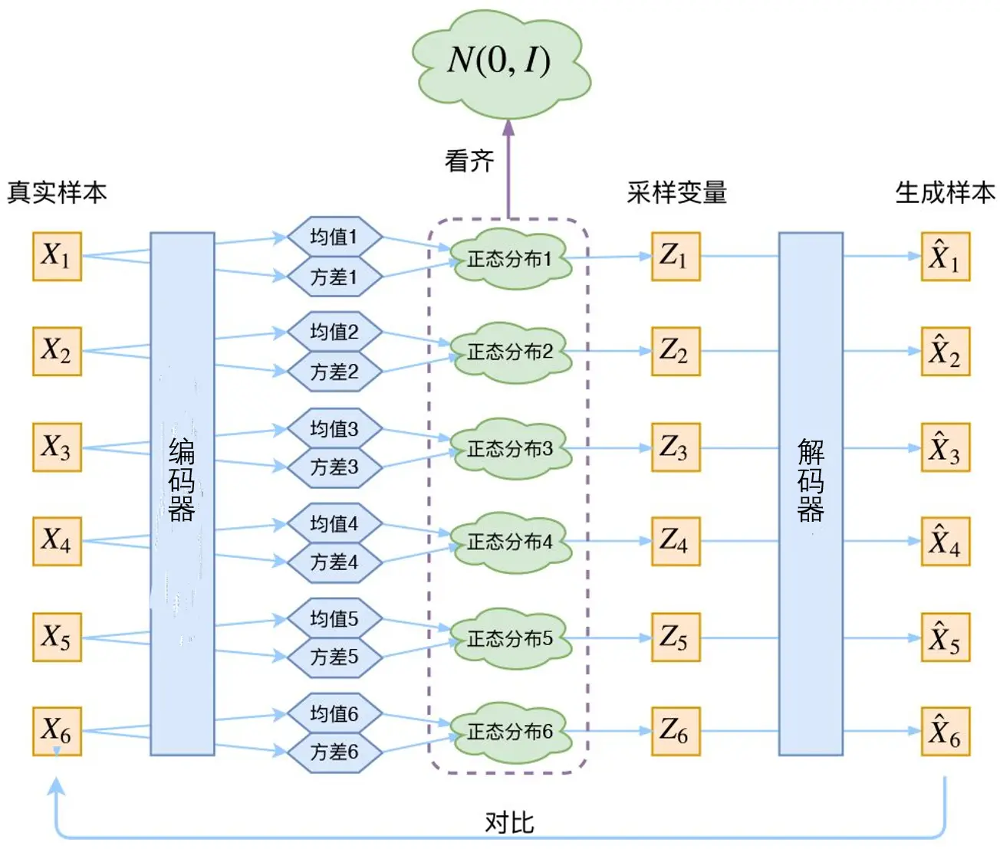
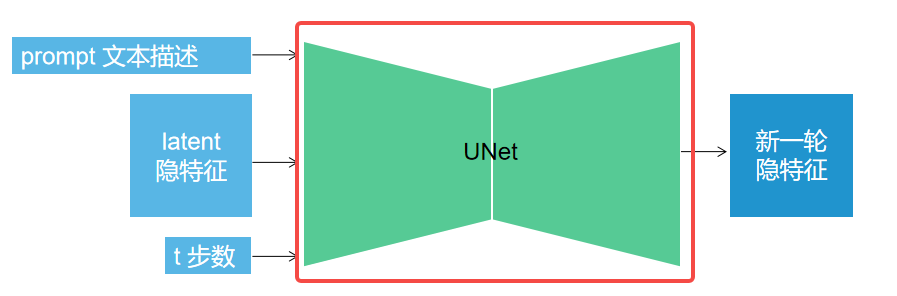
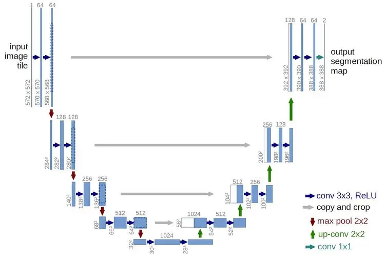

# 人工智能导论自主学习
## StableDiffusion

Stable Diffusion(SD)模型是由Stability AI和LAION等公司共同开发的**生成式模型**，可以用于文生图、图生图、图像inpainting，ControlNet控制生成，图像超分等丰富的任务。

## Stable Diffusion原理
Stable Diffusion和GAN等生成式模型一样的是，SD模型同样学习拟合训练集分布，并能够生成与训练集分布相似的输出结果，但与它们不同的是SD模型的训练过程更加稳定，而且具备更强的泛化性能。

### 扩散模型
Stable Diffusion是一个扩散模型。扩散模型是通过神经网络学习从纯噪声数据逐渐对数据进行去噪的过程，从单个图像样来看，扩散过程就是不断往图像上添加噪声直到图像变成一个纯噪声。逆扩散过程就是从纯噪声生成一张图像的过程。它包含两个步骤：
1. 固定的前向过程$p$：在这一步逐渐将高斯噪声添加到图像中，直到得到一个纯噪声的图像；
2. 可学习的反向去噪过程$p_\theta$：在这一步从纯噪声图像中逐渐对其进行去噪，知道得到真实的图像

Diffusion模型用于生成与训练数据相似的数据。从根本上来说，Diffusion模型的工作原理，是通过连续添加高斯噪声来破坏训练数据，再反转这个过程，用于学习恢复数据。而训练目的便是让扩散模型每次预测出的噪声和每次实际加入的噪声做回归，让扩散模型能预测出每次实际加入的真实噪声。

## Stable Diffusion模型的网络架构
Stable Diffusion主要由VAE（变分自编码器， Variational Auto-Encoder），U-Net以及CLIP Text Encoder三个核心组件构成。

### VAE模型
VAE的Encoder结构能讲输入图像转化为低纬Latent特征，并作为U-Net的输入。VAE的Decoder结构能将低纬Latent特征重建还原成像素级图像。

VAE能够压缩数据，因此可以极大程度缩小计算复杂性，计算效率大大提升，同时也降低了硬件需求。正因如此，Stable Diffusion可以在较低配置的平台上运行。

VAE对图像的压缩可以看作是一个有损压缩，但由于自然图像并非完全随机，而是具有很高的规律性，因此这样的压缩并不会对图像的特征带来很大的损失。这也是模型能够使用VAE进行空间压缩的原因。在损失不大的前提下降低计算量，这便是VAE的作用

StableDiffusion中的VAE编码器实现位于/ldm/models/autoencoder.py，其编码器与解码器定义在ldm/modules/diffusionmodules/model.py中的Encoder类与Decoder类

### U-Net模型
在Stable Diffusion是一个基于潜在扩散模型（LDM， Latent Diffusion Model）的一个模型，U-Net模型是关键核心，其在模型中的主要作用是预测噪声残差，并结合调度算法对特征矩阵进行重构，从而将随机噪声转化成图片。

UNet的算法框架主要由编码器和解码器两个部分组成。编码器使用卷积层和池化层来逐渐见效特征图的尺寸和维度，同时增加特征图的通道数，以便提取输入图像的特征；解码器则使用反卷积层（或上采样）和卷积层来逐渐还原特征图的大小和维度麻醉中输出与原始图像大小相同的特征图。

在编码器和解码器之间，UNet还加入了跳连机制，将编码器中相应层的特征与解码器相应层的特征进行连接，以帮助保留更多的空间信息和细节特征。这种机制使得UNet可以使用来自不同层次的特征信息，从而提高图像分割的准确性和鲁棒性。

UNet整体网络结构呈现U型，因此得名UNet，结构如图所示：

stablediffusion模型中的UNet模型位于/ldm/modules/diffusionmodules/openaimodel.py

### 

## Stable Diffusion模型的训练过程
StableDiffusion的训练过程可以看作是一个加噪声与去噪声的过程，在这个针对噪声的对抗过程中学习生成图片的能力

模型的整体训练逻辑为：
1. 从数据集中随机选择训练样本
2. 从K歌噪声量级中随机抽样一个timestep
3. 产生随机噪声
4. 计算当前产生的噪声数据
5. 将噪声输入**U-Net**预测噪声
6. 计算产生的噪声和预测的噪声的L2损失
7. 计算梯度并进行参数更新

